<div align="center">

# Power Board 230 VAC to 12 V / 5 V

### Isolated mains power supply PCB designed in Altium Designer, with a safety-first layout

[](#electrical-architecture)
[](#overview)
[](#primary--secondary-isolation)
[](https://www.altium.com/altium-designer)

**My first mains-powered design: galvanic isolation, creepage-driven keepouts, power polygons and a multi-layer stackup.**

</div>

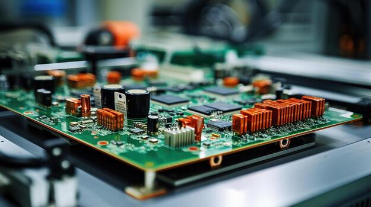

> [!WARNING]
> This board is connected to **230 VAC mains**. It is a learning project that has **not been fabricated nor tested for electrical safety**. Do not build or power it without proper isolation testing and qualified supervision.

## Overview

This project is the complete design of an **AC-DC power board** converting **230 VAC mains** into two isolated DC rails: **12 V / 3 A** and **5 V / 2 A**.

The goal was not only to get a working supply, but to deliberately confront problems I had never handled before and that are central in industry:

- working with the **230 VAC mains** side,
- **galvanic isolation** between primary and secondary,
- **ground and power plane management** in a power context,
- **multi-layer PCB design** driven by electrical safety rules.

| Parameter | Value |
|---|---|
| Input | 230 VAC mains |
| Output 1 | 12 V / 3 A |
| Output 2 | 5 V / 2 A |
| Isolation | Transformer, strict primary / secondary separation |
| Primary protection | Fuse, NTC inrush limiter, varistor (MOV) |
| Secondary | Bridge rectifier, bulk filtering, DC/DC 12 V and 5 V regulation |
| PCB | Multi-layer stackup with dedicated ground layer |
| EDA tool | Altium Designer |
| Status | Design complete, not fabricated |

## Electrical architecture

```text
        PRIMARY (230 VAC, hazardous)       ║        SECONDARY (SELV, isolated)
                                           ║
 230 VAC ──► Fuse ──► NTC ──► MOV ──► ┌────╨────┐ ──► Bridge ──► Bulk C ──► DC/DC 12 V ──┬──► +12 V / 3 A
 (L / N)   overcurrent inrush  surge  │ Isolation│    rectifier  filtering                │
                                      │transform.│                                        └──► 5 V reg. ──► +5 V / 2 A
                                      └────╥────┘
                                           ║   no copper, no via crossing this barrier
```

The design is split into clearly bounded functional blocks, both in the schematic and on the PCB:

1. Mains input 230 VAC
2. Primary protection (fuse, NTC, varistor)
3. Isolation transformer
4. Secondary rectification and filtering
5. DC/DC regulation to 12 V
6. Regulation to 5 V
7. Output distribution and protection

## Schematic

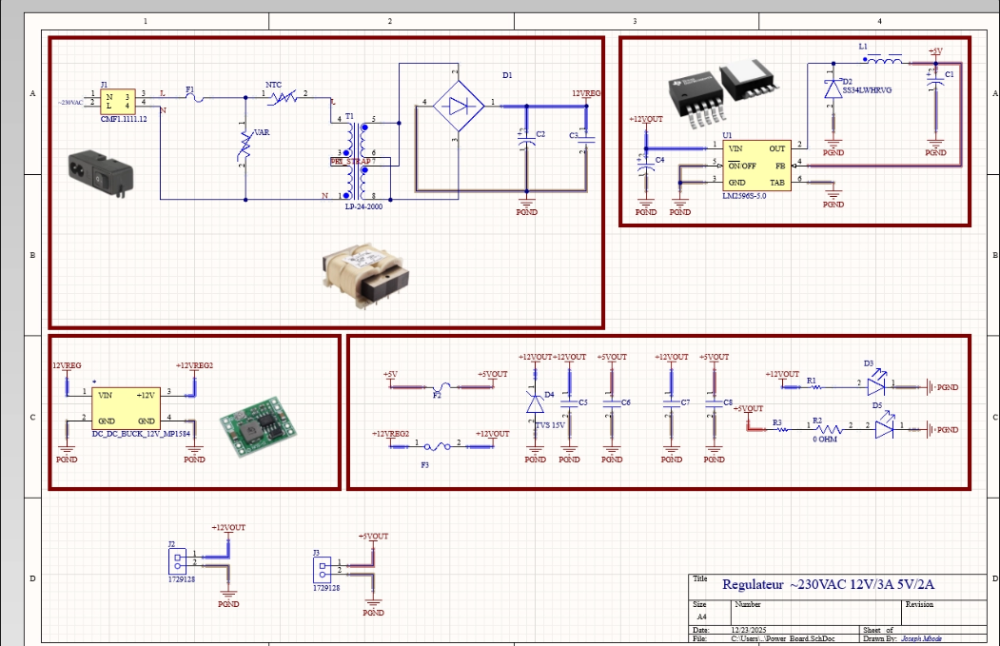

### Mains input and primary side

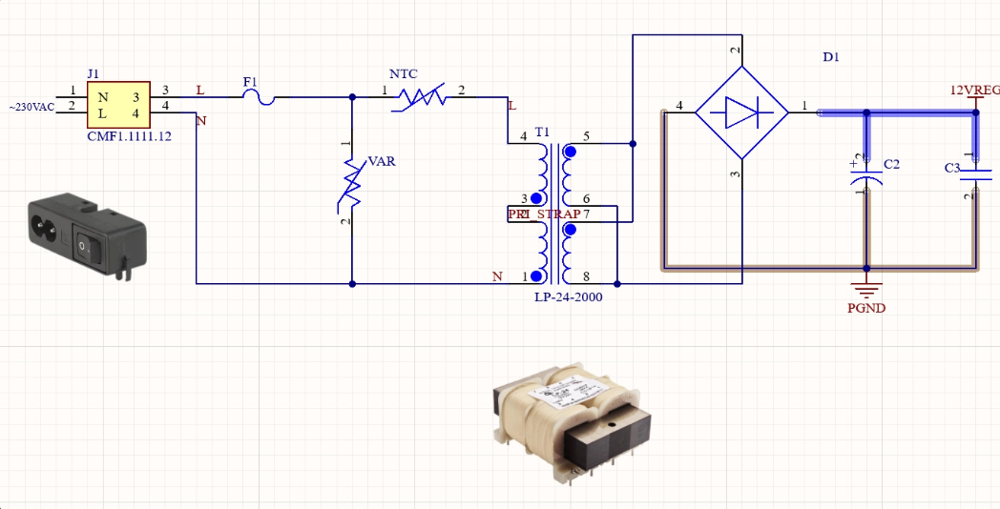

| Component | Role |
|---|---|
| **Fuse** | Overcurrent protection on the mains line |
| **NTC thermistor** | Limits inrush current when the bulk capacitors charge at power-on |
| **Varistor (MOV)** | Clamps transient overvoltages and surges |
| **Isolation transformer** | Steps down the voltage and provides galvanic isolation |
| **Bridge rectifier + bulk capacitors** | Converts secondary AC to filtered DC |

## Primary / secondary isolation

Galvanic isolation was the main driver of the layout.

| 2D layout, primary and secondary zones | Keepout and board regions |
|---|---|
| 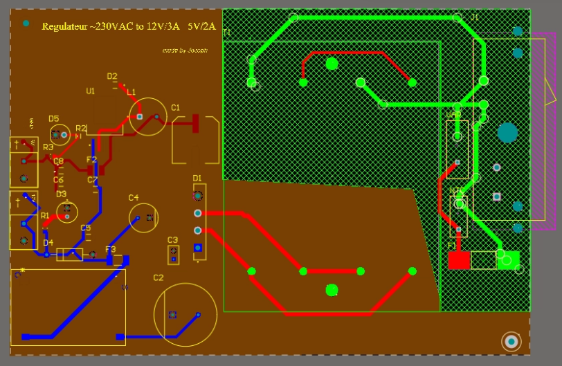 | 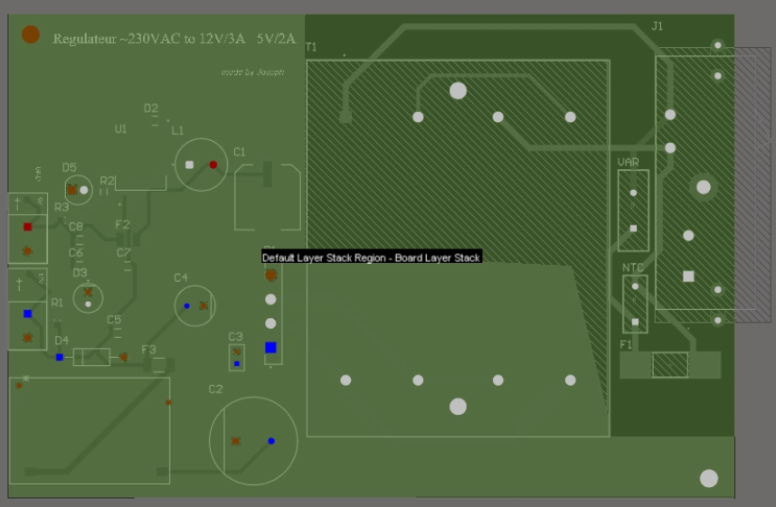 |

What was implemented:

- **Strict physical separation** of the primary and secondary zones.
- **Multi-layer copper keepouts** along the isolation barrier.
- **No copper under the transformer** on the primary zone.
- **Clearance and creepage distances** respected between primary and secondary.
- **No through-via** crossing from primary to secondary.

This is where I understood how safety rules directly shape a PCB, far more than routing convenience.

## Polygons and ground planes

| Polygon pour properties | Polygon settings, second zone |
|---|---|
| 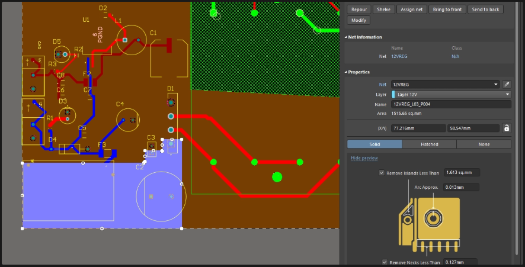 | 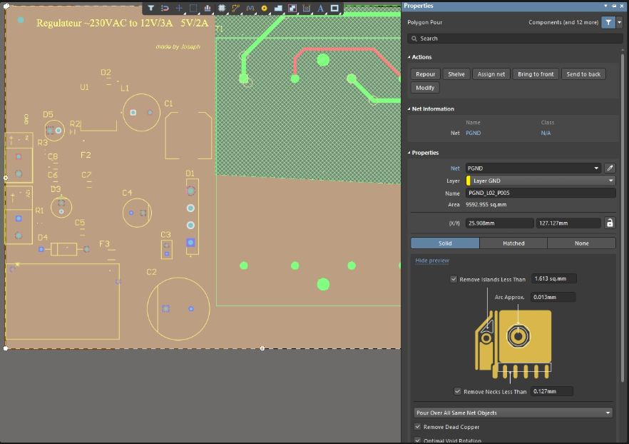 |

First time working with advanced polygon management in a power context:

- dedicated **PGND** ground plane,
- localised **+12 V power polygons**,
- **polygon pour priorities** (pour order),
- interaction between polygons and keepouts,
- **Signal vs Plane** layer types.

It took several iterations and taught me a lot about current return paths, ground continuity and decoupling.

## Power routing

- Wide traces on the mains side and on the 12 V / 5 V outputs.
- Rounded corners on power traces.
- Minimum number of vias on high-current paths.
- Short, direct routing of critical loops.
- Consistent ground return to the PGND plane.

## PCB stackup

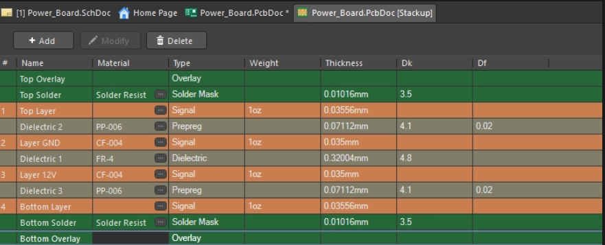

The board uses a multi-layer stackup with signal routing layers and a layer dedicated to ground, organised to limit interference. It was my first design with a deliberate stackup decision and its impact on routing and electrical robustness.

## 3D validation

| Top view | Angled view | Isometric view |
|---|---|---|
| 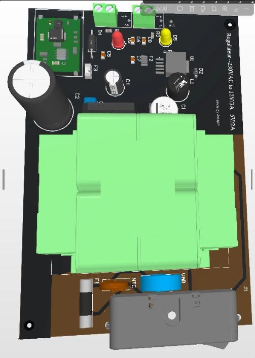 | 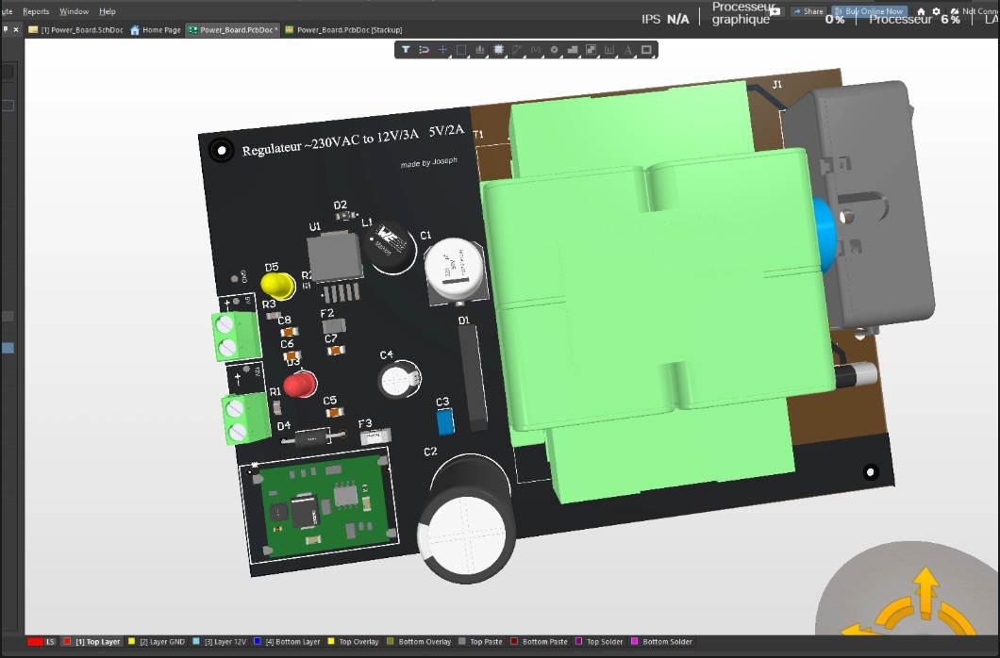 | 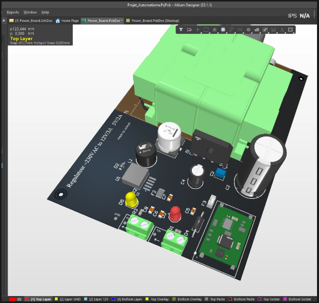 |

The full 3D review was used to check real component heights, transformer and connector fit, and mechanical constraints, as for a real product.

## Project status

| Item | Status |
|---|---|
| Schematic split into functional blocks | Done |
| Primary protection (fuse, NTC, MOV) | Done |
| Primary / secondary isolation with keepouts | Done |
| Power polygons and PGND plane | Done |
| Multi-layer stackup | Done |
| 3D mechanical review | Done |
| Fabrication | Not yet done |
| Hi-pot / isolation test | TBD |
| Output voltage, ripple and load regulation | TBD |
| Thermal behaviour at full load | TBD |

No measurement is reported because the board has not been manufactured yet.

## Repository structure

```text
.
├── asset/
│   └── images/
│       ├── pcb_2d_keepout_board_region.png
│       ├── pcb_2d_layout_primary_secondary.png
│       ├── pcb_3d_angled_view.png
│       ├── pcb_3d_isometric_view.png
│       ├── pcb_3d_top_view.png
│       ├── pcb_layer_stackup.png
│       ├── pcb_polygon_pour_properties.png
│       ├── pcb_polygon_pour_properties_2.png
│       ├── Power_Board_Banner.jpg
│       ├── schematic_full.png
│       └── schematic_primary_mains_input.png
├── Project Outputs for Projet_Automatisme/
│   ├── Design Rule Check - Power_Board.drc
│   └── Design Rule Check - Power_Board.html
├── .gitignore
├── Power Board.PrjPcb
├── Power_Board.PcbDoc
├── Power_Board.SchDoc
└── README.md
```

Open `Power Board.PrjPcb` in Altium Designer to load the full project. DRC report: [`Design Rule Check - Power_Board.html`](Project%20Outputs%20for%20Projet_Automatisme/Design%20Rule%20Check%20-%20Power_Board.html)

## Limitations and future work

**Limitations**

- Not fabricated: no electrical, thermal or isolation validation.
- Creepage and clearance were set by design rules but not checked against a specific standard (e.g. IEC 62368-1) by an independent review.
- Linear transformer architecture: heavier and less efficient than a flyback SMPS.

**Lessons learned**

- On mains designs, safety rules drive the layout before anything else.
- Keepouts must be applied on every copper layer, not only the top.
- Polygon priorities and plane layers need a clear strategy from the start.
- Thinking in functional blocks keeps both schematic and PCB readable.

**Next steps**

- [ ] Review creepage / clearance against IEC 62368-1
- [ ] Add an isolation slot (milled cut-out) under the barrier
- [ ] Generate fabrication files and order the PCB
- [ ] Hi-pot test before any mains connection
- [ ] Measure output voltages, ripple, load regulation and temperature
- [ ] Evaluate a flyback SMPS version for size and efficiency

## Skills

Power electronics · Mains AC-DC design · Galvanic isolation · Creepage and clearance · Keepout design · Polygon and plane management · Multi-layer stackup · Altium Designer · 3D mechanical review

## Author

**Joseph Mbode**

Embedded systems engineer, electronics and PCB design.

- LinkedIn: [Joseph Mbode](https://www.linkedin.com/in/joseph-mbode)
- GitHub: [@Josephulrich](https://github.com/Josephulrich)
